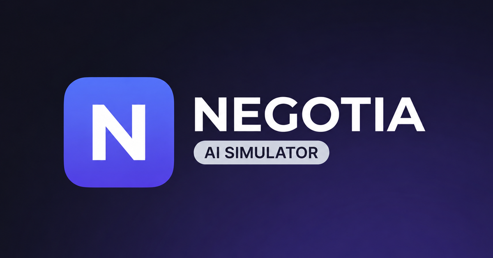

# NEGOTIA — AI Negotiation Simulator

> Тренажёр деловых переговоров с AI-оппонентами. Практикуй реальные сценарии, получай объективный разбор и прокачивай навыки 24/7.



**Live demo:** [arena.cvscore.pro](https://arena.cvscore.pro) ·

---

## 📖 О проекте

**NEGOTIA** — full-stack SaaS-приложение для тренировки навыков переговоров. Пользователь регистрируется, выбирает один из 12 встроенных сценариев (или создаёт свой), готовится по методологиям Harvard / SPIN / BATNA и вступает в диалог с AI-оппонентом в трёх режимах:

- **Chat** — свободный текстовый диалог
- **Voice** — голосовой режим с push-to-talk (Whisper STT + OpenAI TTS с голосами по полу оппонента)
- **Challenge** — выбор из 4 сбалансированных вариантов ответа с оценкой качества (Сильный / Приемлемый / Слабый / Рискованный)

По окончании AI-коуч формирует **debrief** — итоговый разбор с оценками по фреймворкам, скорингом навыков и рекомендациями.

### Ключевые возможности

- ✅ 12 seed-сценариев + собственный **Конструктор сценариев** с RU/EN, выбором пола оппонента и его скрытых интересов
- ✅ SSE-стриминг ответов AI (токен за токеном)
- ✅ Голосовой режим с push-to-talk и гендерно-дифференцированными TTS-голосами (onyx / shimmer)
- ✅ Динамические **coaching-подсказки** от Claude в реальном времени
- ✅ 4 методологии переговоров: Harvard, SPIN, BATNA, Combined
- ✅ Двуязычный интерфейс **RU/EN** с локализованными AI-промптами и русскими именами оппонентов
- ✅ Выбор AI-движка: **Claude Sonnet 5** или **ChatGPT (GPT-5.6 Luna)** — переключается в профиле
- ✅ Magic Link восстановление пароля
- ✅ Учебные материалы `/learn` по методологиям (статика, без токенов)
- ✅ История сессий с удалением
- ✅ Соц-превью через Open Graph / Twitter Cards

---

## 🛠 Технологии

| Слой | Стек |
|---|---|
| **Frontend** | React 19, React Router 7, Tailwind CSS, shadcn/ui, Lucide, axios, sonner |
| **Backend** | FastAPI 0.110, Motor (async MongoDB), Pydantic v2, JWT, bcrypt |
| **AI-движок** | Emergent Universal LLM Key + `emergentintegrations` → Claude Sonnet 5 / GPT-5.6 Luna |
| **Voice** | OpenAI Whisper (STT) + OpenAI TTS (voices: onyx, shimmer) |
| **База** | MongoDB (коллекции: `users`, `scenarios`, `negotiations`, `password_reset_tokens`) |
| **Стриминг** | Server-Sent Events (SSE) |
| **UI-паттерн** | Neomorphic "Stitch" (soft-shadow + inset design system) |

---

## 📁 Структура проекта

```
/app/
├── backend/
│   ├── server.py              # FastAPI-приложение: auth, negotiations, voice, coaching, scenarios
│   ├── frameworks.py          # Логика методологий (Harvard/SPIN/BATNA/Combined)
│   ├── scenarios_seed.py      # 12 seed-сценариев с RU/EN контекстами
│   ├── tests/                 # pytest: test_negotia_api, test_custom_scenarios, ...
│   ├── requirements.txt
│   └── .env                   # MONGO_URL, JWT_SECRET, EMERGENT_LLM_KEY, FRONTEND_URL, AI_MODEL_*
├── frontend/
│   ├── public/
│   │   ├── index.html         # OG-теги + favicon
│   │   ├── favicon.svg
│   │   └── og-image.png       # 1200×629 для соц-превью
│   ├── src/
│   │   ├── App.js             # Роутинг: /auth, /dashboard, /simulate, /scenarios, /negotiation/:id …
│   │   ├── auth/AuthProvider.jsx
│   │   ├── components/
│   │   │   ├── AppShell.jsx   # Каркас с сайдбаром
│   │   │   └── ui/            # shadcn-компоненты
│   │   ├── i18n/
│   │   │   ├── I18nProvider.jsx
│   │   │   ├── translations.js # RU/EN словари UI
│   │   │   └── learnContent.js # Статические учебные материалы
│   │   ├── lib/api.js         # axios-обёртки над /api/*
│   │   └── pages/
│   │       ├── Landing.jsx
│   │       ├── Auth.jsx / ResetPassword.jsx
│   │       ├── Dashboard.jsx / History.jsx / Profile.jsx
│   │       ├── Scenarios.jsx / CustomScenarioBuilder.jsx
│   │       ├── SimulationWizard.jsx  # 7-шаговый мастер
│   │       ├── NegotiationRoom.jsx   # Комната переговоров
│   │       ├── Debrief.jsx           # Разбор
│   │       └── Learn.jsx             # Учебные материалы
│   ├── package.json
│   └── .env                   # REACT_APP_BACKEND_URL, WDS_SOCKET_PORT
├── memory/
│   ├── PRD.md                 # Product requirements + changelog
│   └── test_credentials.md    # Demo-креденшелы
├── test_reports/              # JSON-отчёты тестового агента
└── README.md
```

---

## 🚀 Как запустить

Проект разработан на платформе **Emergent** и работает в контейнеризованном окружении под supervisor. Ниже — воспроизведение локально.

### Требования

- **Python** ≥ 3.11
- **Node.js** ≥ 20 + **Yarn**
- **MongoDB** ≥ 6 (локально или Atlas)

### 1. Клонирование

```bash
git clone <ваш-github-url> negotia
cd negotia
```

### 2. Backend

```bash
cd backend
python -m venv .venv && source .venv/bin/activate
pip install -r requirements.txt
pip install emergentintegrations --extra-index-url https://d33sy5i8bnduwe.cloudfront.net/simple/
```

Создайте `backend/.env`:

```ini
MONGO_URL=mongodb://localhost:27017
DB_NAME=negotia
JWT_SECRET=<случайная-длинная-строка>
EMERGENT_LLM_KEY=<ключ-Emergent-Universal-LLM>
AI_MODEL_PROVIDER=anthropic
AI_MODEL_NAME=claude-sonnet-5
FRONTEND_URL=http://localhost:3000
```

> **Emergent LLM Key** — универсальный ключ, покрывающий Claude, OpenAI (текст + TTS + Whisper + image) и Gemini.

Запуск:

```bash
uvicorn server:app --host 0.0.0.0 --port 8001 --reload
```

### 3. Frontend

```bash
cd frontend
yarn install
```

Создайте `frontend/.env`:

```ini
REACT_APP_BACKEND_URL=http://localhost:8001
WDS_SOCKET_PORT=443
```

Запуск:

```bash
yarn start
```

Откройте [http://localhost:3000](http://localhost:3000).

### 4. Demo-аккаунт

Автодеплой приложения с автоматическим созданием демо аккаунта `demo@negotia.app / Demo1234!` и 12 базовых сценариев.

---

## 🔗 Основные API-эндпоинты

Все маршруты начинаются с `/api` и требуют `Authorization: Bearer <JWT>` (кроме `/auth/*`).

| Метод | Путь | Описание |
|---|---|---|
| POST | `/api/auth/register` · `/login` | Регистрация / логин |
| POST | `/api/auth/forgot-password` | Magic Link на смену пароля |
| POST | `/api/auth/reset-password` · `/magic-login` | Подтверждение токена |
| GET | `/api/scenarios?lang=ru` | Список сценариев (встроенные + свои) |
| POST | `/api/scenarios/custom` | Создать свой сценарий (RU/EN + пол оппонента) |
| DELETE | `/api/scenarios/custom/{slug}` | Удалить свой сценарий |
| POST | `/api/negotiations` | Начать переговоры (mode, framework, language, ai_model) |
| POST | `/api/negotiations/{id}/message-stream` | SSE-стриминг ответа |
| POST | `/api/negotiations/{id}/message` | Не-стриминговый ответ (для тестов) |
| POST | `/api/negotiations/{id}/end` | Завершить (walk_away / make_deal) |
| DELETE | `/api/negotiations/{id}` | Удалить сессию |
| POST | `/api/voice/stt` | Whisper-транскрипция |
| POST | `/api/voice/tts` | Синтез речи (голос по полу оппонента) |
| POST | `/api/coach/hint` | Динамическая подсказка от Claude |
| POST | `/api/prep/analyze` | AI-автозаполнение подготовки |

---

## 🧪 Тесты

Бэкенд-тесты (pytest):

```bash
cd backend
pytest tests/ -v
```

Тестовые данные и отчёты хранятся в `/app/test_reports/iteration_*.json`.

---

## 🌐 Локализация

- Язык UI переключается в `AppShell` (сохраняется в `localStorage.negotia_lang`).
- Все AI-промпты содержат директиву `Write ONLY in <Русский|English>` и подставляют локализованные имена оппонентов (`NAME_RU` / `ROLE_RU` в `server.py`).
- Кастомные сценарии хранят `translations.ru` блок; встроенные — маппинг в `SCENARIO_RU` / `SCENARIO_RU_CTX`.

---

## 🎨 Дизайн-система

**Neomorphic "Stitch"** — soft-shadow UI. Ключевые CSS-классы (в `frontend/src/index.css`):

- `neo-raised` / `neo-raised-sm` — приподнятые блоки
- `neo-inset` — вдавленные (инпуты, скроллеры)
- `neo-raised-hover` — hover-состояние
- `btn-primary` / `btn-ghost`
- `chip chip-emerald|primary|amber|rose|slate` — плашки статусов
- Основные цвета: фон `#FAF9F6`, primary `#4F46E5` (indigo), accent `#7C3AED` (violet)

---

## 🚢 Деплой на Emergent

Приложение собирается и деплоится через Emergent-платформу (кнопка **Deploy** в интерфейсе). При деплое:

- Backend поднимается на внутреннем 8001, Frontend на 3000, оба под supervisor
- Кубернетовский ingress проксирует `/api/*` → backend, всё остальное → frontend
- Секреты берутся из production-`.env` (никаких хардкодов в коде)

Для собственного деплоя (Docker/VPS) — соблюдайте эту же схему: reverse-proxy с правилом `/api → :8001`.

---

## 📄 Лицензия

Проприетарный проект. Все права принадлежат авторам.

---

## 🙏 Благодарности

- **Emergent Platform** — за инфраструктуру, Universal LLM Key и `emergentintegrations`
- **Anthropic** (Claude Sonnet 5) и **OpenAI** (GPT-5.6 Luna, Whisper, TTS) — за AI-мозг
- **shadcn/ui** и **Lucide** — за UI-строительные блоки

---
